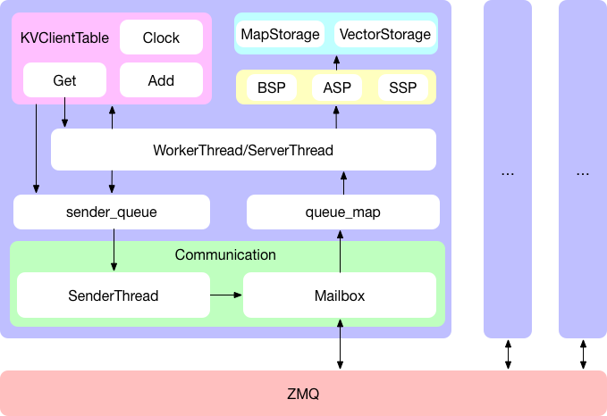
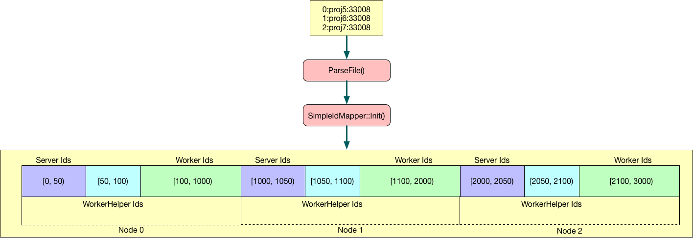
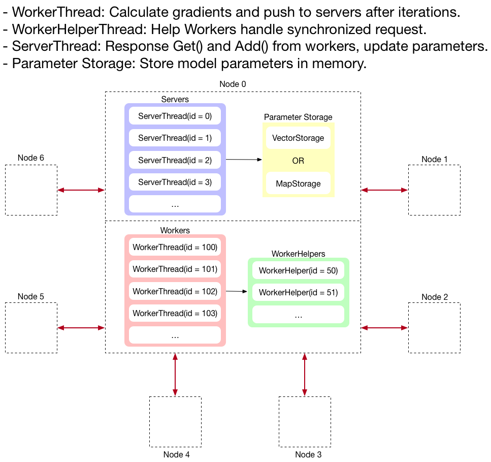
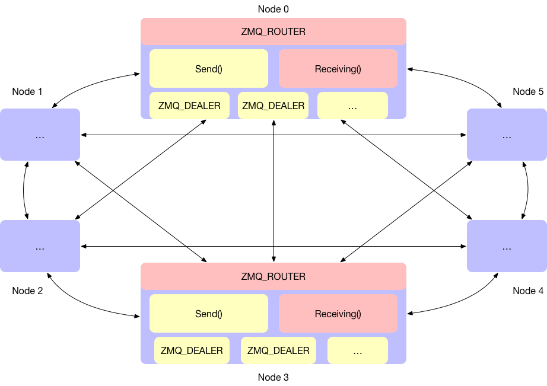
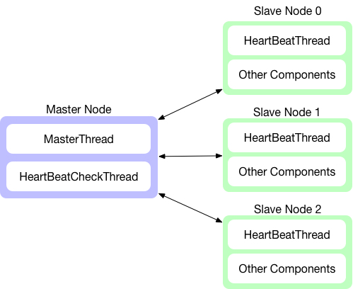
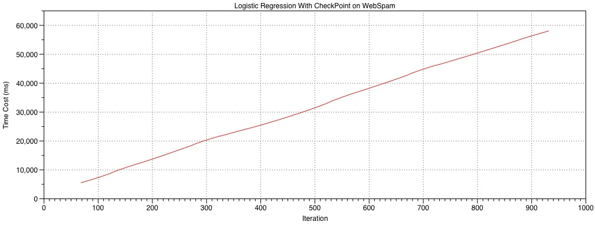
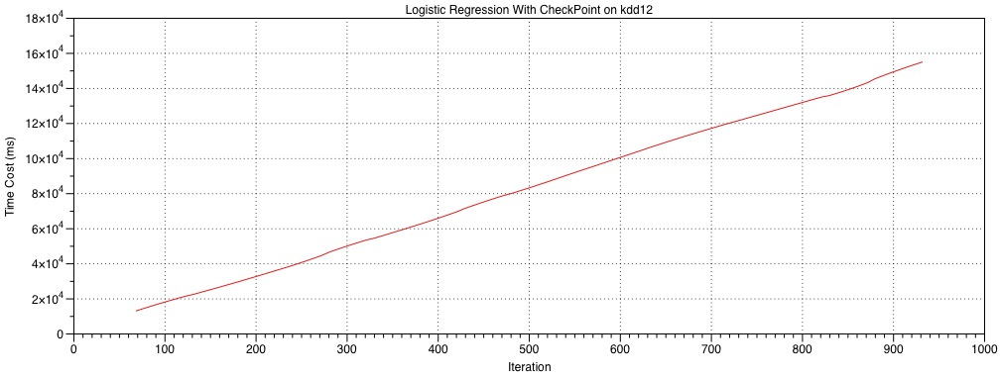
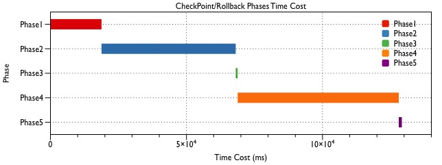

# CSCI5570 Report

## Base Line

### Overview



* `Engine` : The core manager in the framework, interconnected with other module such as Mailbox, Model and Server/WorkerThread in the framework.
* `KVClientTable`:ProvidecoreparameterserverAPIs such as Get, Add and Clock. Other interfaces like CheckPoint and HeartBeat for fault tolerance, Send for communication.
* WorkerThread: Sets the callback when KVClient- Table.Get() is called. When ServerThread gets the data successfully and sends it back, it will send the callback to return the data to KVClientTable.
* ServerThread: The service thread running in the node, providing the response service of Add, Get, Clock.
* SenderThread: A service used to provide communi- cation information between sending nodes, a stand actor-mailbox model is used.
* `PartitionManager`: Provides data partition services according to number of nodes in the cluster for data parallel computing.
* IdMapper: Allocate worker and server threads’ id based on the node configuration. There are maxi- mum 1000 threads running on each machines, the server threads id are range from 0 to 50, while the worker threads id are range from 50 to 100. The id is critical for the communication between different worker and servers.
* Communication Pattern:In the process of communication, the id of sender and receiver is an important identifier, and all ids are allocated according to the id of the machine node to ensure uniqueness. Each id is associated with each WorkThread, ServerThread queue, and the id is used to find the queue of the corresponding thread.
* Mailbox : Encapsulates a set of interfaces for sending and receiving information from ZMQ. By main- taining a map to insert messages into the queues of WorkThread and ServerThread, a typical producer- consumer model.
* Message: The basic data element for communica- tion, it contains important information such as flag that indicate the message’s type, the sender and re- ceiver’s node id, and the updated parameter data.
* Consistency Model: There are three core operations Add, Get and Clock respectively. The first two are used to update and acquire the model parameters. The latter one is to facilitate the synchronization of each node to ensure data consistency. The three com- monly used models are BSP, ASP, SSP.
* ProgressTracker:Themodelparametersclockprogress on different machines, based on the tracker, consis- tency model such as BSP and SSP is able to control the global progress.
* Data Storage: The training data is stored on the dis- tributed storage system called HDFS, each file is par- titioned into blocks and may have several replicas on multiple machines for fault tolerance.
* Parameter Storage: Implement two common com- puter Maps and Vectors for machine learning data processing.
* HDFSManager: Provide useful APIs for developers to load data from HDFS with the classical producer- consumer paradigm.
* `Master` : The master node on the cluster for fault tolerance, when slave machines crashed, the mas- ter is able to detect the error with heartbeat mech- anism, and restart the machine and recover the train- ing progress from last checkpoint.
* MLTask: This model highly related to the machine learning application, which is used to describe the information about the application’s task, it contains data about the table id, worker allocation and run- ning callback.
* Launch Utils: The machine learning applications are running on multiple machines, the framework will allow users launch processes on multiple machines according to the node configuration by python scripts. The script is also able to control the debug or provi- sion environment for test convenience.


### The Id Mapper



### Paramters Get/Add



### The Communication Pattern



## Additional feature - Fault tolerance

### Overview

There are three important operation in the checkpoint/rollback:

1. Store the model parameters and configuration into the file: The checkpoint command should sent by the main node, it will not continue training until all the nodes dump the weights into persistent storage like HDFS or local directory start with `checkpoint_file_prefix`.

2. Detect error with heartbeat mechanism, restart the engine: Since `Clock()` will wait for other nodes' response, if wait for too long, the node will notify other nodes in the cluster to quit training directly
3. Read and recover the model parameters  after restart: The `use_weight_file` toggle and `weight_file_prefix` are used for training progress reload, the node will read and recover the training iteration according to the weight file.

The checkpoint/rollback design:



### CheckPoint Performance





I run the logistic regression on webspam and kdd12 database with checkpoint interval 300, it is obvious that the time cost and iteration count relationship is almost linear, the checkpoint process time cost is wil not influence the training process a lot.

In details, the checkpoint time cost will major depends on the network speed and paramters data size.

### Rollback Performance

I use a example to demonstrate the performance, the configuration is:

* Database: `hdfs:///datasets/classification/webspam`
* CheckPoint Interval: 300 (iterations)
* HeartBeat Interval for Slave Nodes: 15 (s)

There are 7 stages and 5 phases between them:

1. Start checkPoint
2. End checkPoint
3. Kill a running process manually
4. Master detected process failure
5. Failed process restart success
6. Failed Process recover success
7. All nodes in cluster recover success

|Phase|From|To|Time Cost|Percentage|
|---|---|---|---|---|
|1|Start CheckPoint|End CheckPoint|18,771ms|9%|
|2|Kill A Running Process|Master Detect Process Failure|50,023ms|24%|
|3|Master Detect Process Failure|Failed Process Restart Success|10ms|1%|
|4|Failed Process Restart Success|Failed Process Recover Success|122,318ms|65%|
|5|Failed Process Recover Success|All Process Recover Success|30ms|1%|

Sample Output:

```
// [Stage 1] Start checkPoint
I1216 14:49:08.633256 82308 lr_example.cpp:305] [CheckPoint] Start checkpoint...

// dump server progress, model parameters and worker configuration
I1216 14:49:08.636400 166465 vector_storage.hpp:58] Dump Params Storage To hdfs://proj10:9000/ybai/dump_server_params_2
I1216 14:49:08.950397 166465 progress_tracker.hpp:75] Dump Progress Storage To hdfs://proj10:9000/ybai/dump_server_progress_2
I1216 14:49:09.053257 166465 svm_dumper.hpp:58] Dump Config To: hdfs://proj10:9000/ybai/dump_worker_config_2

I1216 14:49:09.206115 82308 lr_example.cpp:309] [CheckPoint] Finish checkpoint, cost time:18771 ms

// [Stage 2] End CheckPoint
// continue iterations
I1216 14:49:13.237511 82308 lr_example.cpp:314] Current iteration=570

// [Stage 3] kill the running process manually
bash: line 1: 162777 Terminated ...1155114481/csci5570/debug/LRExample --my_id=2 

// [Stage 4] Master detect failure
I1216 14:50:03.018653 107004 utils.hpp:52] [Fault Tolerance][Phase2][1544943003] Master Detect Process Failure

// [Stage 5] Killed process restarted
I1216 14:50:03.714398 166739 utils.hpp:52] [Fault Tolerance][Phase3][1544943003] Failed Process Restart Success

// [Stage 6] Restarted process recover data success
I1216 14:52:23.740850 166739 utils.hpp:52] [Fault Tolerance][Phase4][1544943143] Failed Process Recover Success

// [Stage 7] All the nodes in cluster recover success
I1216 14:52:54.005568 167323 utils.hpp:52] [Fault Tolerance][Phase5][1544943174] Other Process Recover Success
```

### Performance Diagram Output



The most time consuming phases are: `Master detect failed node` and `Failed node reload training data`.

## Others

In this session, I demonstrate a bug found on the template while programming on the project.

### HDFS Read

* `Question`: When the given training data file size is too small, and the total file blocks is not enough to allocated to every working node, then some of the nodes will crash because the data is null, and finally the cluster will not continue as the barrier will block other nodes.
* `Solution`: When the given data is not enough for every working node, try to safely shutdown the node that haven't allocated any data, make sure other nodes in the cluster continue working.

Here is a data load example in a single working node:

```cpp
std::vector<SVMItem> data;
lib::AbstractDataLoader<SVMItem, std::vector<SVMItem>> loader;
lib::Parser<SVMItem> parser;
std::function<SVMItem(boost::string_ref)> parse = [parser](boost::string_ref line) {
    // parse data
    return parser.parse_libsvm(line);
};
loader.load(config, my_node, nodes, parse, data);
LOG(INFO) << "Finished loading data!";
```

When the HDFS file block have no data left for read, the data pointer will be NULL, then the app will crash when the task is running.

This is because `hdfs_file_splitter` read the training file block by block, and [node 0] allocate files to other working node. `hdfs_block_size` is usually 128KB or 128MB in HDFS.

io/hdfs_file_splitter.cpp

```cpp
int HDFSFileSplitter::read_block(const std::string &fn) {
    file_ = hdfsOpenFile(fs_, fn.c_str(), O_RDONLY, 0, 0, 0);
    CHECK(file_ != NULL) << "HDFS file open fails";
    hdfsSeek(fs_, file_, offset_);
    size_t start = 0;
    size_t nbytes = 0;
    while (start < hdfs_block_size) {
        nbytes = hdfsRead(fs_, file_, data_ + start, hdfs_block_size);
        start += nbytes;
        if (nbytes == 0)
            break;
    }
    return start;
}
```

When this happened, the working node which no data for trainning should be safely stopped without stop the cluster running.

To solving this, we need detect the no-trainning-data node, and shut it down carefully in the beginning stage.

comm/mailbox.cpp

```cpp
if (msg.meta.flag == Flag::kForceQuit) {
    LOG(INFO) << "Received kForceQuit from" << msg.meta.sender;
    nodes_.erase(std::remove_if(nodes_.begin(), nodes_.end(), [&](Node const & node) {
        return msg.meta.sender == node.id;
    }), nodes_.end());

    engine_->UpdateNodes(nodes_);

    std::unique_lock<std::mutex> lk(mu_);
    quit_count_ += 1;
    if (barrier_count_ + quit_count_ >= nodes_.size()) {
        barrier_cond_.notify_one();
    }
}
```

driver/engine.cpp

```cpp
void Engine::UpdateNodes(std::vector<Node> &nodes) {
    nodes_ = nodes;
    id_mapper_->Update(nodes, 1);
}
```

Force-quit the node if the empty data was read

```cpp
// Quit the engine if no traning data is read
if (data.empty()) {
    LOG(INFO) << "ForceQuit the engine as no data allocated";
    for (auto node : nodes) {
        engine.ForceQuit(node.id);
    }
    engine.StopEverything();
    return;
}
engine.Barrier();
```

